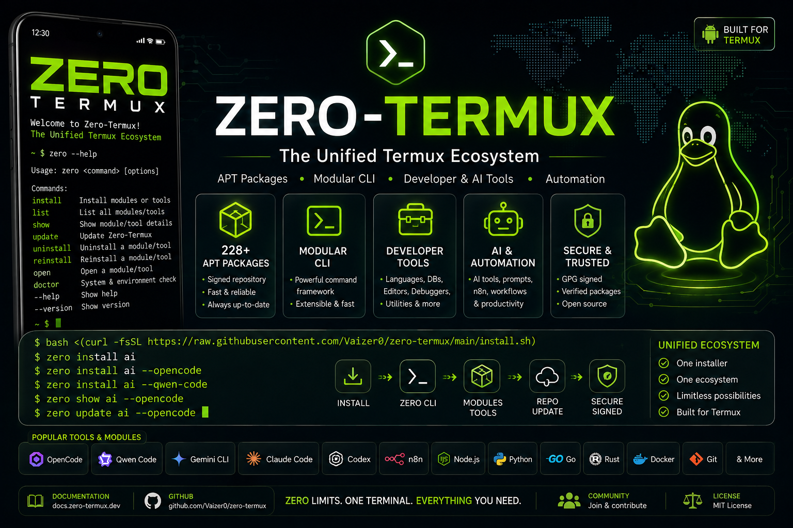
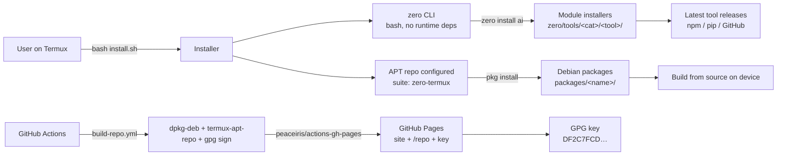

# ◈ Zero-Termux

**Modular dev environment for Termux — one CLI, one signed APT repository, zero setup friction.**

<p align="center">
  <a href="https://github.com/Vaizer0/zero-termux"></a>
  <a href="https://github.com/Vaizer0/zero-termux/actions/workflows/test.yml"></a>
  <a href="https://vaizer0.github.io/zero-termux/docs"></a>
  <a href="./LICENSE"></a>
  <a href="https://termux.dev"></a>
  <a href="https://vaizer0.github.io/zero-termux/packages"></a>
  <a href="https://vaizer0.github.io/zero-termux/packages"></a>
</p>

<p align="center">
  
</p>

<p align="center">
  <a href="https://vaizer0.github.io/zero-termux">
    
  </a>
</p>

Zero-Termux is a complete, Termux-native development environment. A single `zero` CLI — 13 commands, pure bash, zero runtime dependencies — installs, updates, and removes toolchains across 9 modules and 99 tools, while a **signed APT repository** of 228 Debian packages is built from source on your device and served over GitHub Pages. No root, no systemd, no sudo: everything lives under `$HOME` and `$PREFIX`.

## Quick links

| | |
|---|---|
| Website & live docs | [vaizer0.github.io/zero-termux](https://vaizer0.github.io/zero-termux) |
| Command reference | [website](https://vaizer0.github.io/zero-termux/commands) |
| Module explorer | [website](https://vaizer0.github.io/zero-termux/modules) |
| Package catalog & explorer | [assets/PACKAGES.md](assets/PACKAGES.md) • [website](https://vaizer0.github.io/zero-termux/packages) |
| Search | [website](https://vaizer0.github.io/zero-termux/search) |
| Migration | [MIGRATION.md](MIGRATION.md) |
| Contributing / Security | [CONTRIBUTING.md](CONTRIBUTING.md) • [SECURITY.md](SECURITY.md) |

---

## Installation

Termux-only. On a fresh Termux installation:

```bash
bash <(curl -fsSL https://raw.githubusercontent.com/Vaizer0/zero-termux/main/install.sh)
```

<details>
<summary><b>What the installer does</b> — 7 steps</summary>

1. Verifies and installs dependencies (`tput`, `git`, `glow`, `gh`, `rg`, `jq`, `bat`, `curl`).
2. Creates the Zero-Termux directories.
3. Clones the repository (or updates it on re-runs / detects a dev checkout).
4. Symlinks the `zero` command into `$PREFIX/bin/zero`.
5. Configures the **signed APT repository** (sources list + GPG key) and runs `apt update`.
6. Saves the configuration (`zero_data`, `zero_cache`, `zero_config`, `zero_source`, `zero_tool_data`).
7. Prints a summary with next steps.

</details>

> [!NOTE]
> Termux only. No root, no systemd, no sudo — everything runs under `$HOME` and `$PREFIX`.

## Quick Start

```bash
zero --version                    # → 1.0.0
zero list ai                      # list AI tools and their install state
zero install ai --qwen-code       # install one AI tool
zero install dev --gh --fzf --jq  # install a few day-to-day utilities
zero install shell                # ZSH + Oh My Zsh + prompt + plugins
zero update ai                    # update installed AI tools
zero show ai --opencode           # show help for one tool
pkg install zaproxy               # an example APT package
```

Full syntax for every command: [command reference](https://vaizer0.github.io/zero-termux/commands).

## What Zero-Termux Provides

| Area | What Zero-Termux provides |
|---|---|
| CLI | `zero` — modular bash command framework (13 commands, no runtime deps) |
| AI | 36 AI coding and agent tools (`qwen-code`, `opencode`, `claude-code`, `ollama`, …) |
| Development | Language toolchains (8), databases (5), editors (2), dev utilities (22), npm globals (11) |
| Shell & UI | ZSH + Oh My Zsh setup (10) and Termux UI (4) |
| Automation | n8n workflow automation |
| Packages | 228 Debian packages in a GPG-signed APT repository |
| Updates | Rolling/latest strategy for user-facing tools; justified source pins |
| Security | Repository signing + validation on every build |
| Docs | GitHub Pages website with searchable module and package explorers |

## Features

| Feature | Where |
|---|---|
| Install / update / reinstall / uninstall for every tool | `zero install|update|reinstall|uninstall <module> [--tool …]` |
| Second brain (save/search memories) | `zero brain` |
| Project scaffolding | `zero init <template>` |
| PostgreSQL manager | `zero pg` |
| Speech-to-agent | `zero voice <agent>` |
| Environment variable manager | `zero env set|unset|ls` |
| 228-package signed APT repo | `pkg install <tool>` |
| Weekly rolling-version drift report | `.github/workflows/maintenance.yml` |
| CI: build, sign, validate, deploy | `.github/workflows/*.yml` |

---

## Command reference

Every command shares the same four lifecycle verbs: **install / update / reinstall / uninstall**.

| Command | Purpose |
|---|---|
| [`zero install`](https://vaizer0.github.io/zero-termux/commands) | Install a module or specific tools |
| [`zero update`](https://vaizer0.github.io/zero-termux/commands) | Update the framework or a module |
| [`zero uninstall`](https://vaizer0.github.io/zero-termux/commands) | Remove a module or specific tools |
| [`zero reinstall`](https://vaizer0.github.io/zero-termux/commands) | Uninstall then reinstall |
| [`zero list`](https://vaizer0.github.io/zero-termux/commands) | List a module's tools |
| [`zero show`](https://vaizer0.github.io/zero-termux/commands) | Show help for one tool |
| [`zero open`](https://vaizer0.github.io/zero-termux/commands) | Open docs in the browser |
| [`zero init`](https://vaizer0.github.io/zero-termux/commands) | Configure an existing project |
| [`zero brain`](https://vaizer0.github.io/zero-termux/commands) | Second brain (memories) |
| [`zero env`](https://vaizer0.github.io/zero-termux/commands) | Manage env variables |
| [`zero pg`](https://vaizer0.github.io/zero-termux/commands) | PostgreSQL manager |
| [`zero voice`](https://vaizer0.github.io/zero-termux/commands) | Speech-to-agent |
| [`zero --version`](https://vaizer0.github.io/zero-termux/commands) | Show version |

<details>
<summary><b>install</b> — install a module or specific tools</summary>

```
zero install <target> [--tool1 --tool2 …]
```

- `<target>` is a module: `ai`, `lang`, `db`, `editor`, `dev`, `npm`, `shell`, `ui`, `auto`.
- With **no `--tool` flags**, the whole module is installed.
- With flags, only the named tools are installed.

```bash
zero install ai                        # all AI tools (large — can take 1–2 h)
zero install ai --qwen-code --ollama   # just those two
zero install db --postgresql --sqlite
```
</details>

<details>
<summary><b>update</b> — update the framework or a module</summary>

```
zero update <target> [--tool1 --tool2 …]
```

- `zero update zero` updates only the framework (git pull).
- `zero update <module>` runs each tool's update hook.

```bash
zero update zero
zero update ai
zero update npm --ncu
```
</details>

<details>
<summary><b>uninstall</b> — remove a module or specific tools</summary>

```
zero uninstall <target> [--tool1 --tool2 …]
```

```bash
zero uninstall npm
zero uninstall ai --ollama
```
</details>

<details>
<summary><b>reinstall</b> — uninstall + install again</summary>

```
zero reinstall <target> [--tool1 --tool2 …]
```

Useful after a broken install.

```bash
zero reinstall editor
```
</details>

<details>
<summary><b>list</b> — list a module's tools</summary>

```
zero list <target>       # bare `zero list` shows the available targets
```

```bash
zero list ai
zero list dev
```
</details>

<details>
<summary><b>show</b> — show help for one tool</summary>

```
zero show <module> --<tool>
```

```bash
zero show ai --opencode
zero show dev --gh
```
</details>

<details>
<summary><b>open</b> — open documentation in the browser</summary>

```
zero open <target>       # zero | help | zero-termux, or a module anchor
```

```bash
zero open          # → https://vaizer0.github.io/zero-termux/
zero open ai       # → …/#ai
```
</details>

<details>
<summary><b>init</b> — configure an existing project</summary>

```
zero init <template>     # run inside the project directory
```

```bash
zero init next
zero init react
```
</details>

<details>
<summary><b>brain</b> — second brain</summary>

```
zero brain <subcommand>   # init | save | search
```

Stores memories locally (optionally backed by a GitHub repo on `init`).

```bash
zero brain init
zero brain save
zero brain search
```
</details>

<details>
<summary><b>env</b> — manage environment variables</summary>

```
zero env <subcommand>     # set | unset | ls (set/unset are interactive)
```

```bash
zero env set
zero env unset
zero env ls
```
</details>

<details>
<summary><b>pg</b> — PostgreSQL manager</summary>

```
zero pg <command>   # start | stop | restart | create | drop | …
```

```bash
zero pg start
```
</details>

<details>
<summary><b>voice</b> — speech-to-agent</summary>

```
zero voice [agent]   # opencode (default) | claude-code
```

Captures your voice, lets you review the transcript in nvim, copies it, and launches the agent.

```bash
zero voice
zero voice claude-code
```
</details>

<details>
<summary><b>--version</b> — show version</summary>

```bash
zero --version    # → 1.0.0
```
</details>

---

## Modules and tools

9 modules, **99 tools**. `zero list <module>` shows the live list; the website has a searchable [module explorer](https://vaizer0.github.io/zero-termux/modules).

| Module | Tools | What it installs |
|---|---:|---|
| [`ai`](https://vaizer0.github.io/zero-termux/#ai) | 36 | Agentic/LLM coding tools: qwen-code, opencode, claude-code, gemini-cli, ollama, … |
| [`lang`](https://vaizer0.github.io/zero-termux/#lang) | 8 | Node.js, Bun, Python, Perl, PHP, Rust, C/C++, Go |
| [`db`](https://vaizer0.github.io/zero-termux/#db) | 5 | PostgreSQL, MariaDB, MongoDB, SQLite, Redis |
| [`editor`](https://vaizer0.github.io/zero-termux/#editor) | 2 | Neovim-based setup (nvchad) |
| [`dev`](https://vaizer0.github.io/zero-termux/#dev) | 22 | gh, fzf, jq, bat, tmux, curl, wget, openssh, … |
| [`npm`](https://vaizer0.github.io/zero-termux/#npm) | 11 | Vercel, live-server, ncu, ngrok, typescript, prettier, … |
| [`shell`](https://vaizer0.github.io/zero-termux/#shell) | 10 | ZSH + Oh My Zsh, powerlevel10k, plugins |
| [`ui`](https://vaizer0.github.io/zero-termux/#ui) | 4 | Fonts, cursor, extra-keys, welcome banner |
| [`auto`](https://vaizer0.github.io/zero-termux/#auto) | 1 | n8n workflow automation |

<details>
<summary><b>ai</b> — AI tools (36)</summary>

Install any with `zero install ai --<tool>`.

`ampcode`, `antigravity-cli`, `cactus`, `cactus-needle`, `claude-code`, `cline`, `codegraph`, `codex`, `command-code`, `ctx7`, `cursor-cli`, `droid-factory`, `engram`, `freebuff`, `gemini-cli`, `gentle-ai`, `gga`, `goose`, `hermes-agent`, `keelcode`, `kilocode-cli`, `kimchi`, `kimi-code`, `mimocode`, `minimax-cli`, `mistral-vibe`, `oh-my-pi`, `ollama`, `openclaude`, `openclaw`, `opencode`, `openspec`, `pi`, `qoder`, `qwen-code`, `supercode`.

Full details: `zero list ai`, `zero show ai --<tool>`.

> [!CAUTION]
> Full-module AI installs are large and slow (1–2 h): install individual tools unless you want everything.
</details>

<details>
<summary><b>lang</b> — language toolchains (8)</summary>

`nodejs`, `bun`, `python`, `perl`, `php`, `rust`, `clang`, `golang`.
</details>

<details>
<summary><b>db</b> — databases (5)</summary>

`postgresql`, `mariadb`, `mongodb`, `sqlite`, `redis`.
</details>

<details>
<summary><b>editor</b> — code editor (2)</summary>

`neovim`, `nvchad`.
</details>

<details>
<summary><b>dev</b> — development utilities (22)</summary>

`bat`, `bc`, `cloudflared`, `curl`, `fzf`, `gh`, `html2text`, `imagemagick`, `jq`, `lsd`, `make`, `ncurses`, `openssh`, `proot`, `shfmt`, `superfile`, `tmate`, `tmux`, `translate`, `tree`, `udocker`, `wget`.
</details>

<details>
<summary><b>npm</b> — Node.js global modules (11)</summary>

`vercel`, `live-server`, `localtunnel`, `markserv`, `ncu`, `nestjs`, `ngrok`, `prettier`, `psqlformat`, `turbopack`, `typescript`.
</details>

<details>
<summary><b>shell</b> — ZSH (10)</summary>

`better-npm`, `fzf-tab`, `history-substring`, `powerlevel10k`, `you-should-use`, `zsh-autopair`, `zsh-autosuggestions`, `zsh-completions`, `zsh-defer`, `zsh-syntax-highlighting`.
</details>

<details>
<summary><b>ui</b> — Termux UI (4)</summary>

`font`, `cursor`, `extra-keys`, `banner`.
</details>

<details>
<summary><b>auto</b> — automation (1)</summary>

`n8n`.
</details>

> Every tool follows the same contract: `install_<tool>` / `update_<tool>` / `reinstall_<tool>` / `uninstall_<tool>` in `zero/tools/<category>/<tool>/install.sh`.

---

## APT repository

**228 packages**, GPG-signed, published to GitHub Pages. The installer configures this for you; manual setup:

```bash
echo "deb [trusted=yes arch=all] https://vaizer0.github.io/zero-termux/repo zero-termux main" \
  > "$PREFIX/etc/apt/sources.list.d/zero-termux.list"

curl -fsSL https://vaizer0.github.io/zero-termux/zero-termux.gpg \
  -o "$PREFIX/etc/apt/trusted.gpg.d/zero-termux.gpg"

apt update
```

| Action | Command |
|---|---|
| Search | `pkg search <name>` |
| Install | `pkg install <name>` |
| Update lists | `apt update` (or `pkg update`) |
| Remove | `pkg remove <name>` |
| Browse catalog | [assets/PACKAGES.md](assets/PACKAGES.md) • [live explorer](https://vaizer0.github.io/zero-termux/packages) |

### Verify the signing key

```bash
gpg --show-keys "$PREFIX/etc/apt/trusted.gpg.d/zero-termux.gpg"
# Fingerprint: DF2C 7FCD ABF9 6DF4 298E 953B B0C7 EC7C 1BB9 C494
```

> [!NOTE]
> The source is added with `trusted=yes` because the key is also shipped separately for verification; the repository `InRelease` is signed with the key above on every build.

---

## Version policy

- **Rolling user-facing tools → latest.** Registry installs use `@latest` / `-U`; GitHub-release binaries resolve the newest release at install time (no stale fallback).
- **Build-critical / source-tag pins → kept and justified**, each with a `# Zero-Termux: justified pin — <reason>` comment and an entry in the pin manifest.
- **The Debian `Version:` field is the *package* revision** — separate from the installed tool version. It is not displayed as the upstream application version.
- A weekly maintenance workflow (`maintenance.yml`, Mondays 03:00 UTC) reports drift between justified pins and latest upstream; `test.yml` fails on any new unapproved pin.

## Architecture



<details>
<summary><b>Directory layout</b></summary>

```
zero/                          CLI framework (bash, no runtime deps)
  bin/zero                     entry point (resolves symlinks, loads env)
  cli/commands/<cmd>.sh        one file per command (install, list, show, …)
  modules/<cat>.sh             per-category install/update/uninstall logic
  tools/<category>/<tool>/     per-tool installers (+ README.md docs)
  utils/                       bootstrap, env, colors, logging, version helpers
packages/<name>/               Debian package definitions (DEBIAN/control + lifecycle scripts)
scripts/
  build/build-repo.sh          dpkg-deb + termux-apt-repo + gpg signing
  validation/                  CI validators (packages, branding, pins, stale URLs, docs)
  version-check/               rolling-version drift reporter
  maintenance/                 scheduled-checks entrypoint
  site/                        site data generator
site/                          website (multi-page, data-driven)
  data/*.json                  generated: meta, commands, modules, packages
assets/                        PACKAGES.md catalog + zero-termux.gpg (public key)
.github/workflows/             CI/CD: build-repo, test, pages, maintenance
install.sh                     unified installer (7 steps)
```
</details>

## Common workflows

| Goal | Commands |
|---|---|
| Fresh install | `bash <(curl -fsSL https://raw.githubusercontent.com/Vaizer0/zero-termux/main/install.sh)` |
| Install AI tooling | `zero install ai --qwen-code --ollama` |
| Install dev essentials | `zero install dev --gh --fzf --jq --bat` |
| Everything updated | `zero update zero && zero update ai && pkg upgrade` |
| Recover a broken tool | `zero reinstall <module> --<tool>` |
| APT package | `pkg install <name>` |

## Updating Zero-Termux

- **Framework:** `zero update zero` (or re-run the installer — it detects an existing install and pulls).
- **Modules:** `zero update <module> [--tool …]`.
- **APT:** `apt update && pkg upgrade`.

## Troubleshooting

| Symptom | Fix |
|---|---|
| `curl: command not found` | Install it first: `pkg install curl` |
| `zero: command not found` | `ls -l $PREFIX/bin/zero`; re-run the installer |
| `apt update` fails on our repo | Verify connectivity; the repo is served from GitHub Pages (`vaizer0.github.io`) |
| `zero install ai` is slow | Expected — whole-module AI installs take 1–2 h. Install per-tool instead |
| Tool version looks stale | Rolling tools resolve latest at install time; `zero update <module>` re-resolves |
| GPG verify fails | Re-download the key: `curl -fsSL https://vaizer0.github.io/zero-termux/zero-termux.gpg` |

## Migration

Moving from an earlier single-purpose Termux setup? See [MIGRATION.md](MIGRATION.md) — it documents the layout Zero-Termux uses (`$HOME/.local/share/zero-termux`, `$PREFIX/bin/zero`, config under `~/.config/zero-termux`) and how to keep your existing configs intact.

## Security

- The APT repository is **GPG-signed on every build**; the private key exists **only** in GitHub Actions secrets (`PRIVATE_GPG_KEY`, `GPG_PASSPHRASE`); the public key ships as `assets/zero-termux.gpg` and at `…/zero-termux/zero-termux.gpg`.
- Packages and CLI tools **build/install from source on your device** and may write under `$PREFIX` (bin symlinks, share data) and — for themes/fonts/shell modules — into `$HOME` (e.g. `~/.termux`, `~/.config`). Review the lifecycle scripts before installing anything you do not trust.
- Rolling tools fetch the latest release from the **official upstream** (npm/pip/GitHub) at install time; pinned versions are source-tag builds only, documented in the pin manifest.
- Full model, claims, and responsible-disclosure policy: [SECURITY.md](SECURITY.md).

## Contributing

Packages, module installers, docs, and site content are all welcome. Start at [CONTRIBUTING.md](CONTRIBUTING.md) — it covers the tool contract, version policy, validation suite, local testing, and the PR process.

## License

MIT. See [LICENSE](LICENSE). Tools installed through Zero-Termux are governed by their own licenses.

## Links

- Website: <https://vaizer0.github.io/zero-termux>
- Docs: <https://vaizer0.github.io/zero-termux/docs>
- Commands: <https://vaizer0.github.io/zero-termux/commands>
- Module explorer: <https://vaizer0.github.io/zero-termux/modules>
- Package explorer: <https://vaizer0.github.io/zero-termux/packages>
- Site search: <https://vaizer0.github.io/zero-termux/search>
- Repository: <https://github.com/Vaizer0/zero-termux>
- Package catalog: [assets/PACKAGES.md](assets/PACKAGES.md)
- Issues: <https://github.com/Vaizer0/zero-termux/issues>
